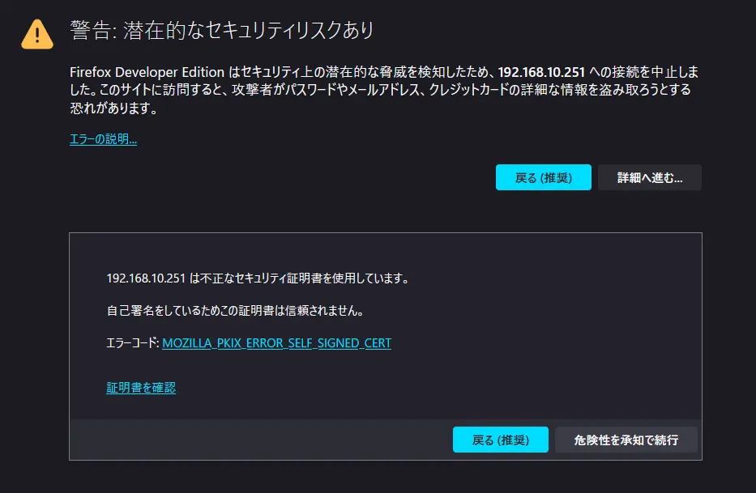
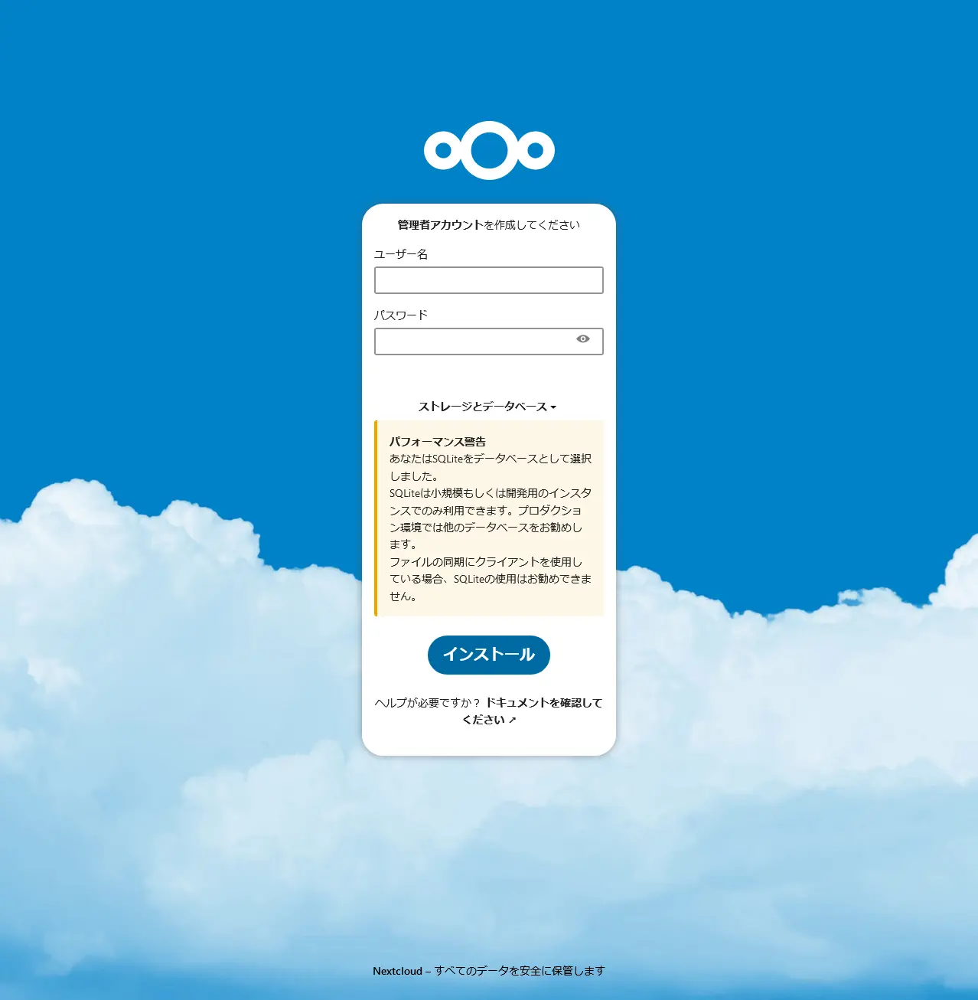
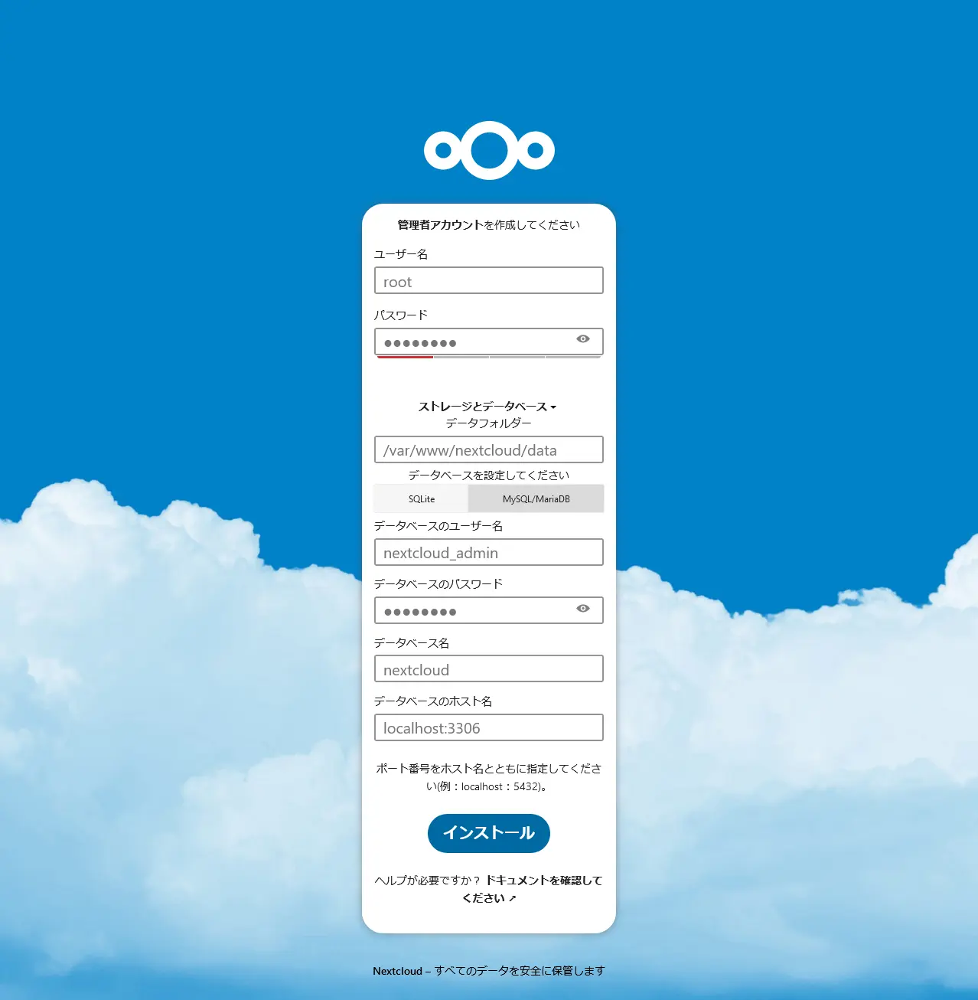
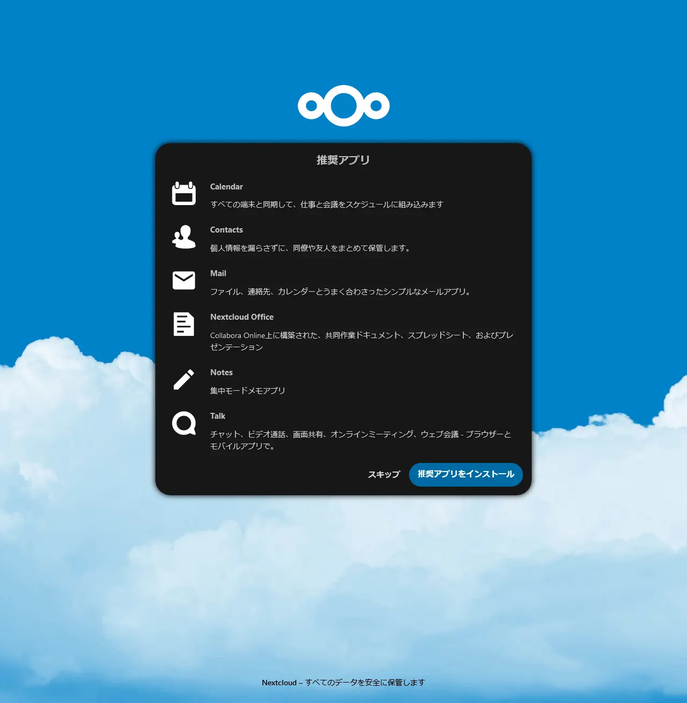
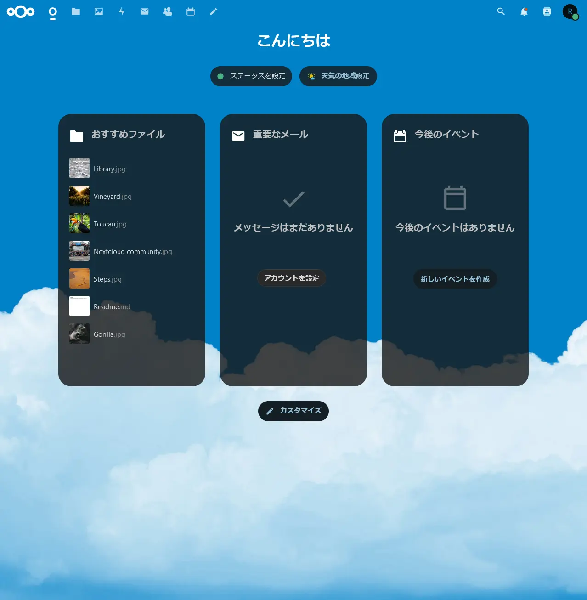
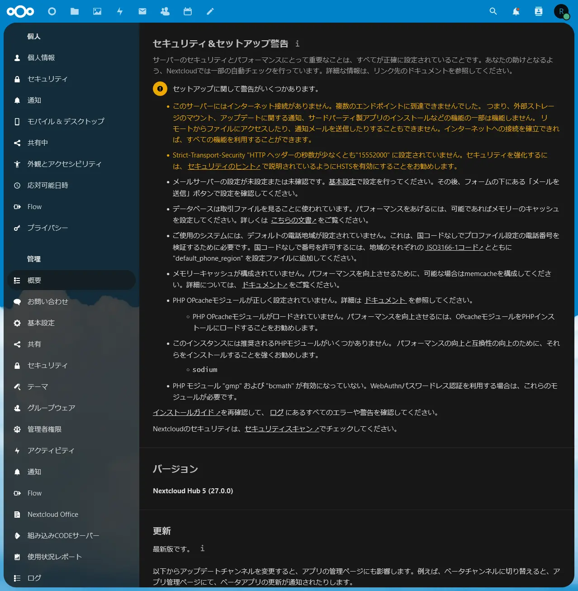
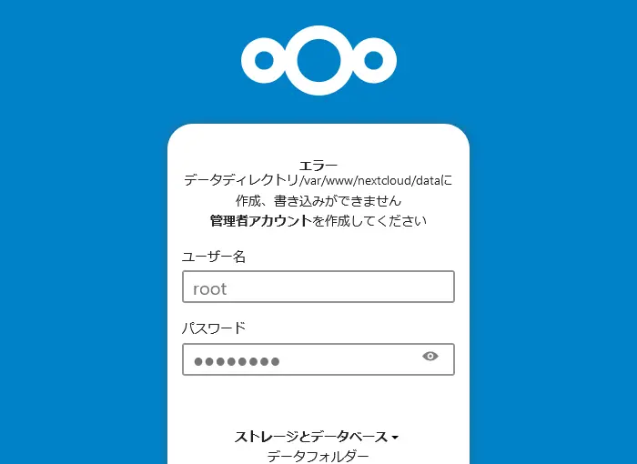
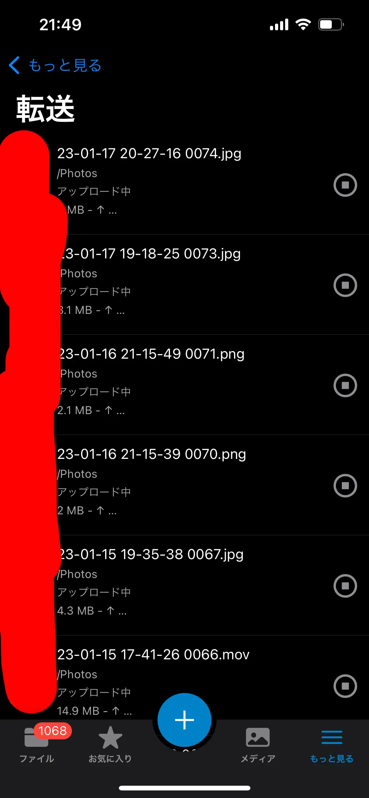

## 構想

[自宅鯖 構想 2023](/posts/2023-04-15-01)

## 関連記事

1. [自宅鯖 構成メモ 2023](/posts/2023-04-12-01)
2. [AlmaLinux 9.1 で自分用のストレージサーバを構築する（KVM ホスト編）](/posts/2023-04-15-02)
3. [AlmaLinux 9.1 で自分用のストレージサーバを構築する（VM ゲスト編）](/posts/2023-04-16-01)
4. [AlmaLinux 9.1 で自分用のストレージサーバを構築する（Nextcloud 編）](/posts/2023-07-04-01) ← イマココ

## Nextcloud とは？

`Nextcloud`とは OSS なオンラインストレージサービス。  
Dropbox や OneDrive のようなサービスを、おうちに構築できる。  
[参考](https://nextcloud.stylez.co.jp/)。

## やったこと

### 1. Nextcloud が動作するためのシステム要件＆インストール手順を確認する

- [システム要件](https://docs.nextcloud.com/server/latest/admin_manual/installation/system_requirements.html)
- [インストール手順](https://docs.nextcloud.com/server/latest/admin_manual/installation/source_installation.html)

### 2. Nextcloud の動作させるために必要なものをインストールする

必要なものをインストールしていく。  
具体的には

- nginx
- PHP 8.1 とモジュール群
- MySQL 8.0+
- FFmpeg

#### nginx

**※ 後述する問題が発生する可能性があるのでおとなしく Apache HTTP Server で構築するのが無難。**

インストール。

```shell
dnf install nginx
```

`nginx -v`でバージョン確認。問題なし。

```shell
nginx version: nginx/1.20.1
```

#### PHP 8.1 とモジュール群

なにもしないと参照しているリポジトリの都合上 PHP8.0 しかインストールできない。  
今回は PHP8.1 をインストールしたいので、PHP8.1 の remi リポジトリを参照できるように設定する。

```shell
dnf install https://rpms.remirepo.net/enterprise/remi-release-$(rpm -E %rhel).rpm
dnf config-manager --set-enabled remi
```

PHP をインストール。

```shell
dnf module reset php
dnf module install php:remi-8.1
```

remi リポジトリから PHP8.1 をインストールすることができる。

```shell
=======================================================================================================================================================
 Package                               Architecture                Version                                     Repository                         Size
=======================================================================================================================================================
Installing group/module packages:
 php-cli                               x86_64                      8.1.20-1.el9.remi                           remi-modular                      5.2 M
 php-common                            x86_64                      8.1.20-1.el9.remi                           remi-modular                      832 k
 php-fpm                               x86_64                      8.1.20-1.el9.remi                           remi-modular                      1.8 M
 php-mbstring                          x86_64                      8.1.20-1.el9.remi                           remi-modular                      521 k
 php-xml                               x86_64                      8.1.20-1.el9.remi                           remi-modular                      203 k
Installing dependencies:
 httpd-filesystem                      noarch                      2.4.53-11.el9_2.5                           appstream                          14 k
 libxslt                               x86_64                      1.1.34-9.el9                                appstream                         240 k
 oniguruma5php                         x86_64                      6.9.8-1.el9.remi                            remi                              219 k
Installing weak dependencies:
 nginx-filesystem                      noarch                      1:1.20.1-14.el9.alma                        appstream                          11 k
Installing module profiles:
 php/common
Enabling module streams:
 php                                                               remi-8.1

Transaction Summary
=======================================================================================================================================================
Install  9 Packages

Total download size: 9.0 M
Installed size: 53 M
Is this ok [y/N]:
```

`php -v`でバージョン確認。問題なし。

```shell
PHP 8.1.20 (cli) (built: Jun  6 2023 23:02:31) (NTS gcc x86_64)
Copyright (c) The PHP Group
Zend Engine v4.1.20, Copyright (c) Zend Technologies
```

現在インストールされている PHP のモジュールは`php -m`で確認できる。

```shell
[PHP Modules]
bz2
calendar
Core
ctype
curl
date
dom
exif
fileinfo
filter
ftp
gettext
hash
iconv
json
libxml
mbstring
openssl
pcntl
pcre
Phar
readline
Reflection
session
SimpleXML
sockets
SPL
standard
tokenizer
xml
xmlreader
xmlwriter
xsl
zlib

[Zend Modules]
```

現在インストールされているモジュールの情報を参考に、足りないモジュールをインストールしていく。  
個人的には、外部認証の予定がないことと、個人利用なのでサーバーのパフォーマンス強化も不要かなということで、[システム要件](https://docs.nextcloud.com/server/latest/admin_manual/installation/system_requirements.html)の

- `Required for specific apps`
- `For enhanced server performance (optional) select one of the following memcaches`

に書いてあるモジュールはインストールしなかった。  
それ以外のモジュールをインストールする。

```shell
dnf install php-gd php-posix php-zip php-mysqlnd php-intl php-imagick
```

```shell
=======================================================================================================================================================
 Package                                           Architecture        Version                                         Repository                 Size
=======================================================================================================================================================
Installing:
 php-gd                                            x86_64              8.1.20-1.el9.remi                               remi-modular               62 k
 php-intl                                          x86_64              8.1.20-1.el9.remi                               remi-modular              209 k
 php-mysqlnd                                       x86_64              8.1.20-1.el9.remi                               remi-modular              214 k
 php-pecl-imagick-im7                              x86_64              3.7.0-7.el9.remi.8.1                            remi-modular              187 k
 php-pecl-zip                                      x86_64              1.22.1-1.el9.remi.8.1                           remi-modular               74 k
 php-process                                       x86_64              8.1.20-1.el9.remi                               remi-modular               64 k
 ...
```

`php -m`で再確認。問題なし。

```shell
[PHP Modules]
bz2
calendar
Core
ctype
curl
date
dom
exif
fileinfo
filter
ftp
gd
gettext
hash
iconv
imagick
intl
json
libxml
mbstring
mysqli
mysqlnd
openssl
pcntl
pcre
PDO
pdo_mysql
pdo_sqlite
Phar
posix
readline
Reflection
session
shmop
SimpleXML
sockets
SPL
sqlite3
standard
sysvmsg
sysvsem
sysvshm
tokenizer
xml
xmlreader
xmlwriter
xsl
zip
zlib

[Zend Modules]
```

**※ 補足**

`php-posix`は`php-process`に含まれるようになった。

**※ 余談**

ちなみに Almalinux 9.1 で`rpm -E %rhel`を実行すると`9`と表示されるよ。  
OS のメジャーバージョンが変わってもコピペで対応できるね。  
検索キーワード: RPM マクロ

#### MySQL 8.0+

MySQL の 8.0 より高いバージョンをインストールする。  
普通にインストールすれば OK。

```shell
dnf install mysql mysql-server
```

`mysql --version`でバージョン確認。問題なし。

```shell
mysql  Ver 8.0.32 for Linux on x86_64 (Source distribution)
```

#### FFmpeg

おそらく Nextcloud （Web）上で音声や動画を表示する際に使うはず。

まず EPEL リポジトリと PowerTools(CRB) を有効にする。

```shell
dnf install epel-release
dnf config-manager --set-enabled crb
```

次に RPM Fusion リポジトリを追加する。

```shell
dnf install --nogpgcheck https://mirrors.rpmfusion.org/free/el/rpmfusion-free-release-$(rpm -E %rhel).noarch.rpm
```

FFmpeg インストール。

```shell
dnf install ffmpeg
```

`ffmpeg -version`でバージョン確認。問題なし。

```shell
ffmpeg version 5.1.3 Copyright (c) 2000-2022 the FFmpeg developers
...
```

## 3. サービスの開始＆自動起動設定を行う

### nginx

```shell
systemctl start nginx.service
systemctl enable nginx.service
```

### php-fpm

```shell
systemctl start php-fpm.service
systemctl enable php-fpm.service
```

### MySQL

```shell
systemctl start mysqld.service
systemctl enable mysqld.service
```

## 4. nextcloud を配置する

`/var/www/`下に配置する。

```shell
wget  https://download.nextcloud.com/server/releases/latest.tar.bz2
dnf install bzip2
tar jxvf latest.tar.bz2
mv nextcloud /var/www/.
```

## 5. オレオレ証明書の作成

とりあえずローカルネットワーク内で使用できれば OK なのでオレオレ証明書で凌ぐ。  
openssl をインストールする。

```shell
dnf install openssl
```

オレオレ証明書を作成。[参考](https://qiita.com/snowmoon/items/9c96ee0fa6ed096e8940)。

```shell
mkdir /etc/ssl/nginx
openssl genrsa -out /etc/ssl/nginx/server.key 2048
openssl req -new -key /etc/ssl/nginx/server.key -out /etc/ssl/nginx/server.csr
openssl x509 -days 3650 -req -signkey /etc/ssl/nginx/server.key -in /etc/ssl/nginx/server.csr -out /etc/ssl/nginx/server.crt
```

## 6. nginx の設定を行う

`vim /etc/nginx/conf.d/nextcloud.conf`で、Nextcloud 用の nginx の conf ファイルを作成＆追記する。

[公式 Doc](https://docs.nextcloud.com/server/latest/admin_manual/installation/nginx.html)を参考に、基本的にはコピペで OK。  
変更点として、

- php-handler は`/etc/nginx/conf.d/php-fpm.conf`に書いてある内容に合わせる
- HTTPS 通信のための証明書は手順 5で作成したオレオレ証明書を参照するように設定する

nginx の conf ファイルの構文に問題がないかどうかは`nginx -t`で確認できる。

```conf
upstream php-handler {
    # server 127.0.0.1:9000;
    server unix:/run/php-fpm/www.sock;
}

# Set the `immutable` cache control options only for assets with a cache busting `v` argument
map $arg_v $asset_immutable {
    "" "";
    default "immutable";
}


server {
    listen 80;
    listen [::]:80;
    server_name 192.168.10.xxx;

    # Prevent nginx HTTP Server Detection
    server_tokens off;

    # Enforce HTTPS
    return 301 https://$server_name$request_uri;
}

server {
    listen 443      ssl http2;
    listen [::]:443 ssl http2;
    server_name 192.168.10.xxx;

    # Path to the root of your installation
    root /var/www/nextcloud;

    # Use Mozilla's guidelines for SSL/TLS settings
    # https://mozilla.github.io/server-side-tls/ssl-config-generator/
    ssl_certificate     /etc/ssl/nginx/server.crt;
    ssl_certificate_key /etc/ssl/nginx/server.key;
    # ssl_certificate     /etc/ssl/nginx/cloud.example.com.crt;
    # ssl_certificate_key /etc/ssl/nginx/cloud.example.com.key;

    # Prevent nginx HTTP Server Detection
    server_tokens off;

    # HSTS settings
    # WARNING: Only add the preload option once you read about
    # the consequences in https://hstspreload.org/. This option
    # will add the domain to a hardcoded list that is shipped
    # in all major browsers and getting removed from this list
    # could take several months.
    #add_header Strict-Transport-Security "max-age=15768000; includeSubDomains; preload" always;

    # set max upload size and increase upload timeout:
    client_max_body_size 512M;
    client_body_timeout 300s;
    fastcgi_buffers 64 4K;

    # Enable gzip but do not remove ETag headers
    gzip on;
    gzip_vary on;
    gzip_comp_level 4;
    gzip_min_length 256;
    gzip_proxied expired no-cache no-store private no_last_modified no_etag auth;
    gzip_types application/atom+xml text/javascript application/javascript application/json application/ld+json application/manifest+json application/rss+xml application/vnd.geo+json application/vnd.ms-fontobject application/wasm application/x-font-ttf application/x-web-app-manifest+json application/xhtml+xml application/xml font/opentype image/bmp image/svg+xml image/x-icon text/cache-manifest text/css text/plain text/vcard text/vnd.rim.location.xloc text/vtt text/x-component text/x-cross-domain-policy;

    # Pagespeed is not supported by Nextcloud, so if your server is built
    # with the `ngx_pagespeed` module, uncomment this line to disable it.
    #pagespeed off;

    # The settings allows you to optimize the HTTP2 bandwitdth.
    # See https://blog.cloudflare.com/delivering-http-2-upload-speed-improvements/
    # for tunning hints
    client_body_buffer_size 512k;

    # HTTP response headers borrowed from Nextcloud `.htaccess`
    add_header Referrer-Policy                   "no-referrer"       always;
    add_header X-Content-Type-Options            "nosniff"           always;
    add_header X-Download-Options                "noopen"            always;
    add_header X-Frame-Options                   "SAMEORIGIN"        always;
    add_header X-Permitted-Cross-Domain-Policies "none"              always;
    add_header X-Robots-Tag                      "noindex, nofollow" always;
    add_header X-XSS-Protection                  "1; mode=block"     always;

    # Remove X-Powered-By, which is an information leak
    fastcgi_hide_header X-Powered-By;

    # Add .mjs as a file extension for javascript
    # Either include it in the default mime.types list
    # or include you can include that list explicitly and add the file extension
    # only for Nextcloud like below:
    include mime.types;
    types {
        js mjs;
    }

    # Specify how to handle directories -- specifying `/index.php$request_uri`
    # here as the fallback means that Nginx always exhibits the desired behaviour
    # when a client requests a path that corresponds to a directory that exists
    # on the server. In particular, if that directory contains an index.php file,
    # that file is correctly served; if it doesn't, then the request is passed to
    # the front-end controller. This consistent behaviour means that we don't need
    # to specify custom rules for certain paths (e.g. images and other assets,
    # `/updater`, `/ocm-provider`, `/ocs-provider`), and thus
    # `try_files $uri $uri/ /index.php$request_uri`
    # always provides the desired behaviour.
    index index.php index.html /index.php$request_uri;

    # Rule borrowed from `.htaccess` to handle Microsoft DAV clients
    location = / {
        if ( $http_user_agent ~ ^DavClnt ) {
            return 302 /remote.php/webdav/$is_args$args;
        }
    }

    location = /robots.txt {
        allow all;
        log_not_found off;
        access_log off;
    }

    # Make a regex exception for `/.well-known` so that clients can still
    # access it despite the existence of the regex rule
    # `location ~ /(\.|autotest|...)` which would otherwise handle requests
    # for `/.well-known`.
    location ^~ /.well-known {
        # The rules in this block are an adaptation of the rules
        # in `.htaccess` that concern `/.well-known`.

        location = /.well-known/carddav { return 301 /remote.php/dav/; }
        location = /.well-known/caldav  { return 301 /remote.php/dav/; }

        location /.well-known/acme-challenge    { try_files $uri $uri/ =404; }
        location /.well-known/pki-validation    { try_files $uri $uri/ =404; }

        # Let Nextcloud's API for `/.well-known` URIs handle all other
        # requests by passing them to the front-end controller.
        return 301 /index.php$request_uri;
    }

    # Rules borrowed from `.htaccess` to hide certain paths from clients
    location ~ ^/(?:build|tests|config|lib|3rdparty|templates|data)(?:$|/)  { return 404; }
    location ~ ^/(?:\.|autotest|occ|issue|indie|db_|console)                { return 404; }

    # Ensure this block, which passes PHP files to the PHP process, is above the blocks
    # which handle static assets (as seen below). If this block is not declared first,
    # then Nginx will encounter an infinite rewriting loop when it prepends `/index.php`
    # to the URI, resulting in a HTTP 500 error response.
    location ~ \.php(?:$|/) {
        # Required for legacy support
        rewrite ^/(?!index|remote|public|cron|core\/ajax\/update|status|ocs\/v[12]|updater\/.+|oc[ms]-provider\/.+|.+\/richdocumentscode\/proxy) /index.php$request_uri;

        fastcgi_split_path_info ^(.+?\.php)(/.*)$;
        set $path_info $fastcgi_path_info;

        try_files $fastcgi_script_name =404;

        include fastcgi_params;
        fastcgi_param SCRIPT_FILENAME $document_root$fastcgi_script_name;
        fastcgi_param PATH_INFO $path_info;
        fastcgi_param HTTPS on;

        fastcgi_param modHeadersAvailable true;         # Avoid sending the security headers twice
        fastcgi_param front_controller_active true;     # Enable pretty urls
        fastcgi_pass php-handler;

        fastcgi_intercept_errors on;
        fastcgi_request_buffering off;

        fastcgi_max_temp_file_size 0;
    }

    # Serve static files
    location ~ \.(?:css|js|mjs|svg|gif|png|jpg|ico|wasm|tflite|map)$ {
        try_files $uri /index.php$request_uri;
        add_header Cache-Control "public, max-age=15778463, $asset_immutable";
        access_log off;     # Optional: Don't log access to assets

        location ~ \.wasm$ {
            default_type application/wasm;
        }
    }

    location ~ \.woff2?$ {
        try_files $uri /index.php$request_uri;
        expires 7d;         # Cache-Control policy borrowed from `.htaccess`
        access_log off;     # Optional: Don't log access to assets
    }

    # Rule borrowed from `.htaccess`
    location /remote {
        return 301 /remote.php$request_uri;
    }

    location / {
        try_files $uri $uri/ /index.php$request_uri;
    }
}
```

## 7. php-fpm を編集する

`/etc/php-fpm.d/www.conf`を編集する。  
`env[PATH]`は`echo $PATH`の実行結果にする。

```shell
[root@ap-al91 ~]# echo $PATH
/root/.local/bin:/root/bin:/usr/local/sbin:/usr/local/bin:/usr/sbin:/usr/bin
```

```conf
; Pass environment variables like LD_LIBRARY_PATH. All $VARIABLEs are taken from
; the current environment.
; Default Value: clean env
env[HOSTNAME] = $HOSTNAME
env[PATH] = /root/.local/bin:/root/bin:/usr/local/sbin:/usr/local/bin:/usr/sbin:/usr/bin
env[TMP] = /tmp
env[TMPDIR] = /tmp
env[TEMP] = /tmp
```

**※ 上記項目はデフォルトでは「;」でコメントアウトされているため、忘れずに先頭の「;」を削除する。**

## 8. php.ini を編集する

`/etc/php.ini`を編集する。  
この VM に対して 8GB のメモリを割り当ててあるので、その範囲内で適当に割り当てる。

```ini
memory_limit = 4G
post_max_size = 2G
upload_max_filesize = 2G
```

## 9. MySQL の設定を行う

root でログイン。パスワードは何も入力しない。

```shell
mysql -p -u root
```

Nextcloud 用のデータベースとデータベースを操作するユーザを作成する。

```shell
CREATE DATABASE nextcloud DEFAULT CHARACTER SET utf8mb4;
SHOW DATABASES;
CREATE USER 'nextcloud_admin'@'localhost' IDENTIFIED BY 'hogehoge';
GRANT ALL ON nextcloud.* TO 'nextcloud_admin'@'localhost';
SHOW GRANTS FOR 'nextcloud_admin'@'localhost';
exit;
```

## 10. ポートを開放する

```shell
firewall-cmd --list-all
firewall-cmd --zone=public --add-service=http --permanent
firewall-cmd --zone=public --add-service=https --permanent
firewall-cmd --reload
firewall-cmd --list-all
```

## 11. reboot

いろいろやったので reboot。

## 12. Nextcloud のセットアップ

Nextcloud をセットアップする。

まずは`/var/www/nextcloud`ディレクトリの所有者を`apache`にする。

```shell
chown -R apache:apache /var/www/nextcloud
```

次に`/var/www/nextcloud`下の`config`と`apps`ディレクトリに書き込み権限を追加する。

```shell
chmod g+w /var/www/nextcloud/config
chmod g+w /var/www/nextcloud/apps
chmod o+w /var/www/nextcloud/config
chmod o+w /var/www/nextcloud/apps
```

SELinux を一時的に無効にする。

```shell
setenforce 0
```

ここまで完了したら、`http://サーバのIPアドレス`でアクセスする。  
オレオレ証明書を使っているため、FireFox では下の画像のような警告が出るが無視して進む。



Nextcloud のセットアップ画面が表示されるので、DB に MySQL を使うように設定する。





設定が一通り完了すると以下の画面に遷移する。  
「推奨アプリをインストール」する。



完了すると以下の画面に遷移する。



画像・動画ファイルが閲覧できることを確認する。

## 13. SELinux の設定を行う

[公式 Doc](https://docs.nextcloud.com/server/latest/admin_manual/installation/selinux_configuration.html)を参考に、必要そうなものを設定していく。

```shell
semanage fcontext -a -t httpd_sys_rw_content_t '/var/www/nextcloud/data(/.*)?'
semanage fcontext -a -t httpd_sys_rw_content_t '/var/www/nextcloud/config(/.*)?'
semanage fcontext -a -t httpd_sys_rw_content_t '/var/www/nextcloud/apps(/.*)?'
semanage fcontext -a -t httpd_sys_rw_content_t '/var/www/nextcloud/.htaccess'
semanage fcontext -a -t httpd_sys_rw_content_t '/var/www/nextcloud/.user.ini'
semanage fcontext -a -t httpd_sys_rw_content_t '/var/www/nextcloud/3rdparty/aws/aws-sdk-php/src/data/logs(/.*)?'

restorecon -Rv '/var/www/nextcloud/'

setsebool -P  httpd_unified  off
```

終わったら reboot。

Nextcloud を開き、手順実行前と同じように使えることを確認する。

## 14. ディスクマウント

前回、VM にパススルーした RAID ディスクを`/var/www/nextcloud/data`にマウントする。

念のためにサービス停止。

```shell
systemctl stop nginx.service
systemctl stop php-fpm.service
systemctl stop mysqld.service
```

`/var/www/nextcloud/data`下のデータを RAID ディスクに移す。

```shell
mount /dev/vdb /mnt
rsync -avh --progress /var/www/nextcloud/data/* /mnt/.
```

`/var/www/nextcloud/data`下のデータを削除して先程のディスクをマウント。

```shell
rm -rf /var/www/nextcloud/data/*
mount /dev/vdb /var/www/nextcloud/data
```

忘れずに`/etx/fstab`へ登録を行う。

```txt
...
UUID=blkidコマンドで調べたUUID /var/www/nextcloud/data xfs defaults 1 2
...
```

終わったら reboot。

Nextcloud を開き、手順実行前と同じように使えることを確認する。

## 15. 後始末

### MySQL の root ユーザのパスワードを設定する

初期設定では root ユーザにパスワードが設定されていない状態になっているのでパスワードを設定して保護する。

```shell
ALTER USER 'root'@'localhost' identified BY 'hogehoge';
```

### セキュリティ＆セットアップ警告を解決する

とりあえずここまで作業を行った状態で Nextcloud に管理者でログインし、管理者設定を開く。  
管理者設定では、「セキュリティ＆セットアップ警告」を確認することができる。  
現時点で表示されている警告は以下の通り。



とりあえず黄色文字で書かれている部分をサクッと直す。

#### このサーバーにはインターネット接続がありません。

selinux で許可を与えるだけ。  
[参考](https://help.nextcloud.com/t/this-server-has-no-working-internet-connection-it-does-really/67524)。

```shell
setsebool -P httpd_can_network_connect 1
```

#### Strict-Transport-Security "HTTP ヘッダーの秒数が少なくとも"15552000" に設定されていません。

設定しよう。  
具体的には手順 6で設定した nginx の conf ファイルのコメントを外すだけ。  
[参考](https://qiita.com/fluo10/items/1665e3500aace239c257#nginx-%E3%81%AE%E8%A8%AD%E5%AE%9A)。

```conf
server {
    listen 443      ssl http2;
    ...
    add_header Strict-Transport-Security "max-age=15768000; includeSubDomains; preload" always;
    ...
}
```

完了したら、nginx を再起動。

※ [Strict-Transport-security とは？](https://developer.mozilla.org/ja/docs/Web/HTTP/Headers/Strict-Transport-Security)

#### その他

PHP のモジュール系は追加して php-fpm を再起動すれば OK。

```shell
dnf install php-sodium
dnf install php-bcmath
dnf install php-gmp
dnf install php-opcache

systemctl restart php-fpm.service
```

長くなりそうなので他の警告で対応が必要なものはまた今度やる。~~（めんどくさい 😇）~~

## ハマった点＆対策

### 「データディレクトリ/var/www/nextcloud/data に作成、書き込みができません」「管理者アカウントを作成してください」

#### 症状

手順 12で、当初は`apache:apache`ではなく`nginx:nginx`でセットアップを進めていたところ、下画像のようなエラーメッセージが表示された。



#### 対策

ディレクトリの所有者を`nginx:nginx`ではなく`apache:apache`に設定すると.ocdata ファイルを読むことができた。  
`apache:apache`は RedHat 系の OS で Web サーバがデフォルトで通常の操作に使用するユーザ？みたい。[参考](https://qiita.com/micron/items/56cdc72112f2f9b09fa2)。  
ただ、慣習的には`nginx:nginx`で設定したいところ。より良い対処法を知っている人がいたら教えて 🙏

### ログイン無限ループ問題

#### 症状

正しいユーザ ID とパスワードを入力しているのにログインできない。  
特にエラーメッセージが表示されるわけでもなく、ログイン画面に戻されてしまう。

#### 対策

[こちらの記事](https://diary.d-yoshi.com/%E3%80%90nextcloud%E3%80%91%E3%83%AD%E3%82%B0%E3%82%A4%E3%83%B3%E3%83%AB%E3%83%BC%E3%83%97-3-%E3%82%A2%E3%83%83%E3%82%B5%E3%83%AA%E8%A7%A3%E6%B1%BA/)を参考に session ディレクトリ下の所有者を`apache:apache`に変更するとログインできるようになった。  
Almaliux9.1 での session ディレクトリのパスは`/var/lib/php/session`だった。

考察: 今回は個人用だから要らないかなと思って導入してないけど、 redis と連携するように設定すればセッションをそっちで管理してくれるはずなので自ずと解決する？

### Office ファイルが閲覧できない

#### 症状

Office ファイルが Nextcloud（Web）上で閲覧できない。  
Nextcloud Office の設定画面を見ると、「Collabora Online サーバーへの接続を確立できませんでした。Web サーバーの設定が不足していることが原因かもしれません。詳細については、以下をご覧ください。[Nginx で Collabora Online へシングルクリック接続](https://www.collaboraoffice.com/online/connecting-collabora-online-built-in-code-server-with-nginx/)」と表示される。

#### 対策

個人的には写真・動画のバックアップに使えればそれで OK なので、 Office ファイルの閲覧が Web 上でできなくてもまあいいかということで放置。  
解決したら書く。

考察: nginx で構築したとき固有の問題のようなので、素直に Apache HTTP Server を使えばこのような問題は発生しないと思われる。

## ここまでの手順を実施後、iPhone で撮影した画像・動画をアップロードしている様子



## 自分用メモ

`Cloudflare Tunnel` を使って外部公開する予定であれば HTTPS 化する必要はない。  
80、443 ポートを避けて、 HTTP で通信できるように設定する。（例: 8080）  
ポートを開放する必要なし。
