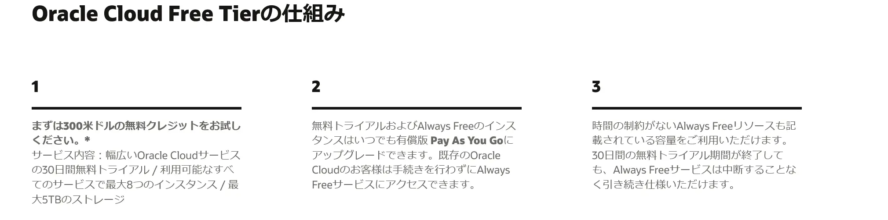
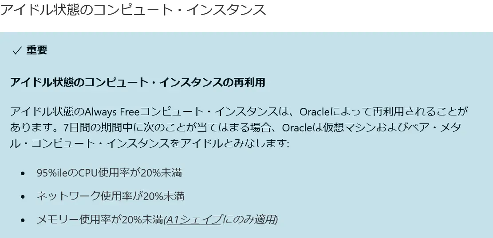
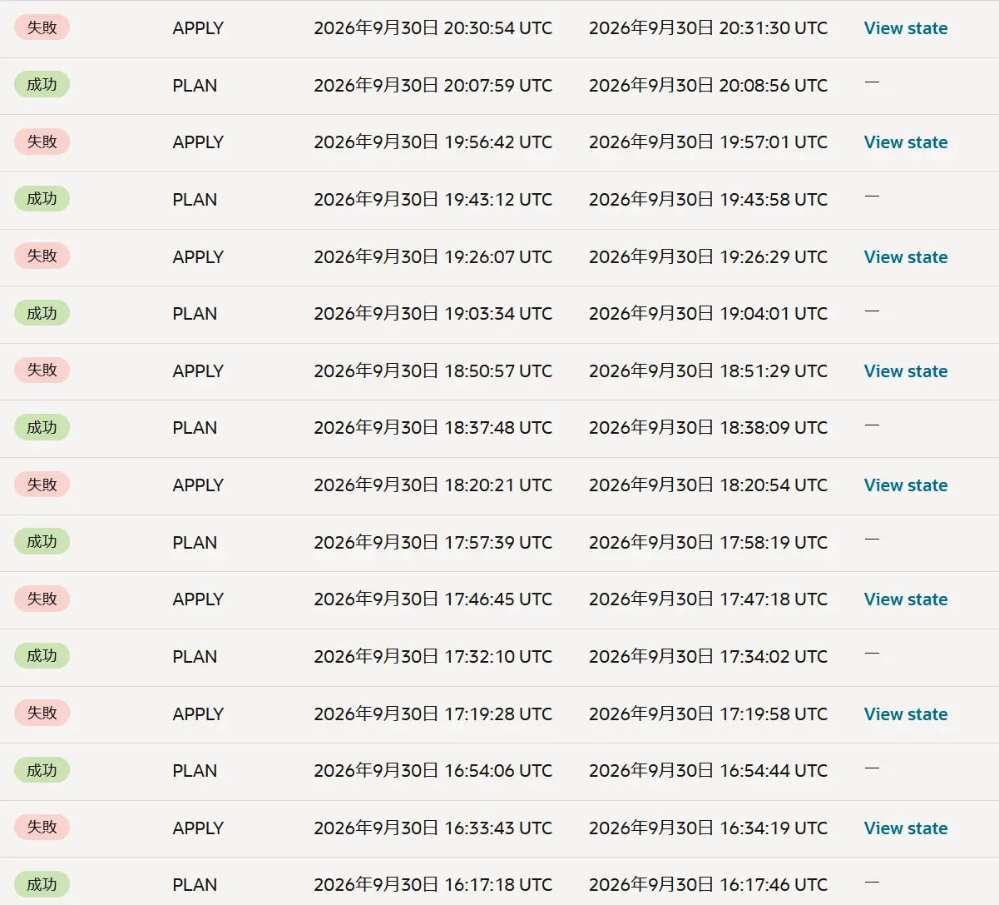

## 背景

最近、ネトゲ友達と「Terraria」というゲームをプレイする機会が増えました。

```txt
『Terraria』（テラリア）は、Re-Logicが開発した大人気のアクションアドベンチャー・オープンワールドのサンドボックスゲームです。
「2D版Minecraft」とも呼ばれることがありますが、戦闘、ボス戦、RPG要素、豊富なアイテム作成（クラフト）に非常に強く焦点を当てているのが大きな特徴です。
```

「ワールド」と呼ばれるゲームデータを作成して、あらかじめ作成しておいた「キャラクター」でそのワールドに入り、建築や戦闘などを楽しむゲームです。

通常、ワールドはゲーム内で好きなパラメータを選択・またはゲームにおまかせして作成します。

PC版であれば、作成したワールドは`.wld`というファイル形式で、作成した人のPCのローカルに保存されます。

この状態で友人とマルチプレイを行うには、ワールドデータを持っている人がTerrariaを起動してゲーム内でマルチプレイを選択し、自分がいちばん最初にワールドに入っている（つまりワールドを起動している）必要があります。

今回、自分がワールドの作成者（ホスト）になったのですが、複数人で進めていることと、ワールドに入りたい時間がメンバーそれぞれで微妙に異なっていることから、「ワールドを24時間ホスティングしておけるゲームサーバがあったら便利だな」と思い、クラウド上でのゲームサーバの構築・運用について検討してみることにしました。

## 無料でサーバを建てるには？

一般的に、身内との小規模なゲームサーバの構築方法として挙がるのは、各社の提供する「VPS」をレンタルする方法でしょう。

```txt
VPS（仮想専用サーバー）とは、1台の物理サーバーの中に複数の仮想的な専用サーバーを構築する仕組みのことです。
```

しかし、当たり前ですが、VPSをレンタルして運用していくためには**おかね**がかかります。

「無料でレンタルできるサーバなんてねえよなあ。。。」と、諦めているそこの貴方へ、Linux周りに詳しいかつ、構築・運用にあたって少々面倒なことがあっても問題ないのであれば、私は「Oracle Cloud（OCI）」を候補に入れても良いんじゃないかと思います。

## Oracle Cloud（OCI）とは？

Oracle Cloud（OCI）は、Oracle社が提供するクラウドコンピューティングサービスです。

代表的なクラウドコンピューティングサービスは、「Amazon Web Services（AWS）」や「Google Cloud（GCP）」などがあります。

クラウドコンピューティングサービスは、既に構築された仮想サーバ（VPS）をレンタルする形式ではなく、仮想サーバを自分の好きな要件でいくつでも構築できますし、ネットワークの設定なり、やろうと思えば他にもいろんなことができます。

クラウドコンピューティングサービスはVPSをレンタルするケースと比較して自由度が高いですが、VPSをレンタルする方がはるかに安上がりなのと、構築にはVPSをレンタルするよりも高度な知識が必要なため、身内とのゲームサーバ用途でクラウドコンピューティングサービスが候補に挙がることはまずありません。

しかし、Oracle Cloudには「Free Tier」なるものがあります。

https://www.oracle.com/jp/cloud/free/

## Oracle Cloud Free Tier（Always Free）のすごさ

Oracle Cloud Free Tierには、こんな特典があります。（執筆時点）



もちろん「１」・「２」のサービスも魅力的ではあるのですが、注目したいのは「３」の「Always Free」です。

https://docs.oracle.com/ja-jp/iaas/Content/FreeTier/freetier_topic-Always_Free_Resources.htm

この、Always Freeのすごいところは、Oracleの提示する要件内の仮想サーバであれば「無料」で構築できるところです。

無料で構築できる仮想サーバ（以下、「インスタンス」と表現します）のスペックは、「使用可能なシェイプ」の項目に書いてあります。

```
使用可能なシェイプ

- マイクロ・インスタンス(AMDプロセッサ): すべてのテナンシは、AMDプロセッサを含むVM.Standard.E2.1.Microシェイプを使用して最大2つのAlways Free VMインスタンスを取得します。

- OCI Ampere A1 Computeインスタンス(Armプロセッサ):すべてのテナンシは、VM.Standard.A1を使用するVMインスタンスに対して、月ごとに最初の1,500 OCPU時間および9,000 GB時間/月を取得します。Armプロセッサを含むフレックスシェイプ。Always Freeテナンシの場合、これは2 OCPUおよび12 GBのメモリーに相当します。
```

AMDインスタンスの方は控えめなスペックではありますが、Discord用の簡単なチャットボットを動かしておく程度なら必要十分なスペックだと思います。

ヤバいのはARMインスタンスの方。

**Always Freeテナンシでは、合計すると2 OCPU / RAM 12GB相当まで無料**

無料でこんなスペックのインスタンスを作っていいんですか...？

参考までに、日本国内にVPSのホストサーバがある、他社のVPSサーバの料金をざっとChatGPTに調査してもらいました。

```txt
Oracle Cloud Always Freeで利用できるAmpere A1の2 OCPU / 12GB RAMという構成は、一般的な国内VPSではかなり特殊である。
国内VPSでは2コア程度なら月額1,000円前後で借りられるものの、RAM 8～16GBクラスになるとCPUも6～8コア程度まで増え、月額3,000～1万円以上になる。  
特に近い構成としてC社には6コア / 12GB RAMのプランがあり、月額約4,400円。CPU性能は単純比較できないものの、OCI A1 2 OCPU / 12GBを国内VPSへ置き換える場合、おおむね月額3,500～4,500円程度、年間4～5万円程度のサーバに相当すると考えると分かりやすい。
```

Ampere A1 2 OCPU/RAM 12GBの構成が特殊なため単純な比較はできませんが、Oracle Cloudの無料インスタンスはメモリが潤沢なため、メモリが大量にほしい用途であれば、**VPSなら月額3,500～4,500円クラス**のスペックに相当するようです。

そんなにメモリは要らないよ！というケースであっても、VPSの「2 vCPU」とOCIの「2 OCPU」はCPUアーキテクチャや仮想化方式、CPU世代などが異なるため単純比較できませんが、VPSの2コア=2 OCPUと単純に換算すると、**VPSなら月額1,000円クラス**のスペックはありそうです。

そして、なんといっても「Always Free」なわけですから、「**常に無料**」です。

...Oracleの気が変わらなければ。

## Oracle Cloud Free Tier（Always Free）の弱点

無料とは思えないスペックのインスタンスを作成できるOracle Cloud Free Tier（Always Free）ですが、世の中に「うまい話」はありませんし、今回の話も例外ではありません。

Always Freeのページの「アイドル状態のコンピュート・インスタンス」には、**条件によってはインスタンスが削除される**趣旨の内容が書いてあります。

https://docs.oracle.com/ja-jp/iaas/Content/FreeTier/freetier_topic-Always_Free_Resources.htm




つまり、ゲームサーバとして運用していくなら、消えるとマズいファイルは必ず定期的に他社サービスにバックアップを取っておく必要がありますし、インスタンス削除からすぐに復旧できるようにゲームサーバはdockerイメージで建てる・削除されたあとのインスタンス再作成＆サーバ復旧までのつなぎをどうするか？・定期的なモニタリング（インスタンスが削除されていないか・アイドル状態と判定される条件に該当していないか）・OracleがFree Tier（Always Free）の条文を変更していないかチェック...等も行う必要があります。

これを読んだ時点で、「他社サービスへのバックアップって何を使ったらいいの？」とか、「定期バックアップってどうやるの？」とか、「dockerってなに？」と思っている人には、これらの知識・スキルはこの方法でゲームサーバを構築するためには必須になってくるので、私としてはお勧めしないです。

## 無料でインスタンスを作成してみた

作成の方法については、他で詳しく解説されているため省略させていただきます。

参考までに、自分は以下のような条件と流れでインスタンスを作成できました。

### 条件

- リージョンは大阪
- マシンスペックはCPU Arm Ampere A1 2 OCPU / RAM 12GB
- OSはAlmaLinux 9.8

### インスタンス作成までの流れ

| だいたいの時間（JST） | やったこと |
| --- | --- |
| 1日目 11時 | OCIのアカウントを作成し、OCIにログインできるようになる。 |
| 1日目 15時 | 構成を選択し、無料インスタンス作成を試みるも、失敗。<br>作成に失敗した理由はOracle側のホストマシンに無料インスタンスを作成するだけのリソースが残っていないため。 |
| 1日目 21時 | 無料インスタンスの作成に再挑戦するも、同様の理由で失敗。<br>この時点で、手動での無料インスタンス作成がほぼ無理なことを悟る。 |
| 1日目 23時 | とどのつまり空きリソースの取り合い。<br>手動で何度もポチポチするのはしんどいので、インスタンスを作成できるまで自動で動き続けるスクリプト（後述）を実行することに。 |
| 2日目 11時 | Pay As You Go（従量課金制プラン）へアップグレードするとインスタンスが作成しやすくなるという情報を見かけたため、試しにアップグレード。<br>無料の枠内であれば、アップグレードしても請求が発生することはない。 |
| 2日目 14時 | 自動スクリプトによってインスタンスが作成されていることを確認（インスタンスの作成に成功）。 |

### スクリプト

こちらのスクリプトをWSLのAlmaLinux 10環境で23時から翌日の14時まで実行しました。

https://github.com/jitendhull/oracle-vps-script

だいたいこれくらいの間隔で実行されていきます。APPLYジョブが実際にインスタンスを作成しようとしているジョブです。




APPLYジョブはコケ続けていますが、理由はすべて「`Out of host capacity.`」でした。

APPLYに成功した瞬間は感動モノです。


## 感想

無料でリソースを提供していただいているOracle様には頭が上がりません。

この記事を執筆している段階でTerrariaサーバとしての構築が完了したため、今月中に人力による負荷試験を実施予定です。

...まあ、インスタンスが生きていればの話ですが。

次回は月末あたりに、このインスタンスの安否についての記事を執筆する予定です。